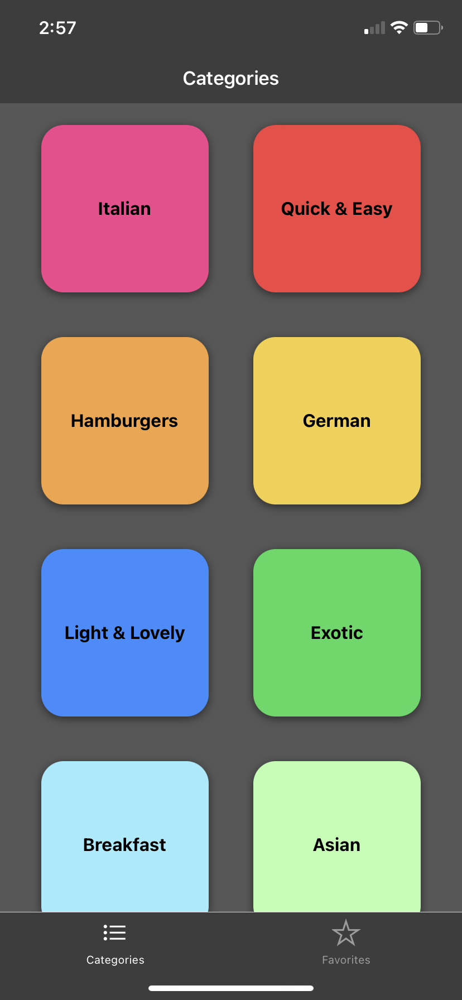
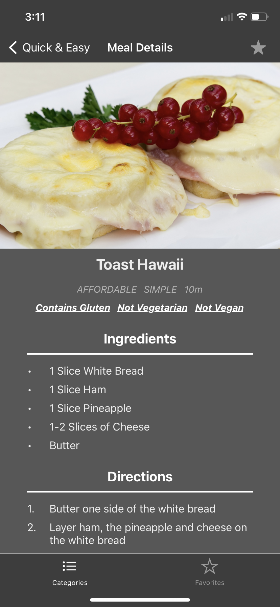
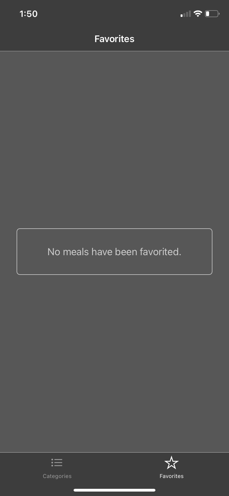
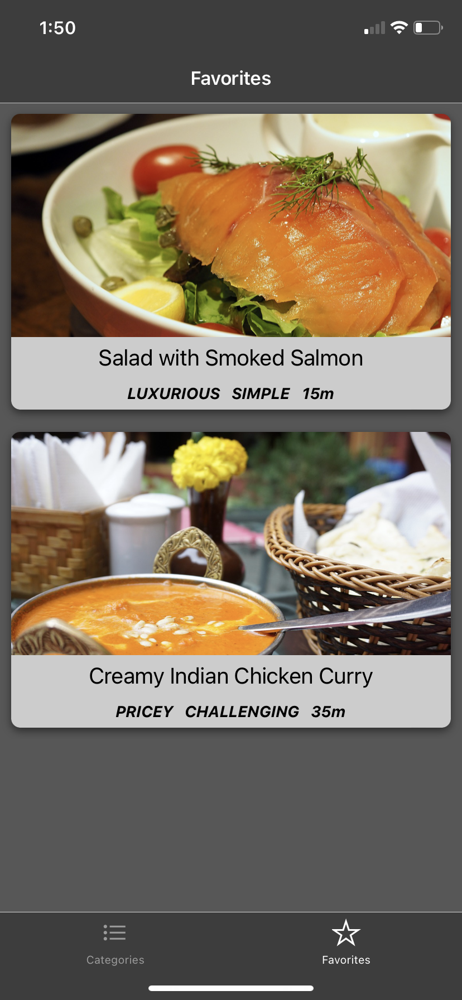

# View Meals App
A practice application meant for practicing react-navigation and redux toolkit that allows the user to view meals in a categorized fashion and star their favorite meals.

 
 
 
 
 

